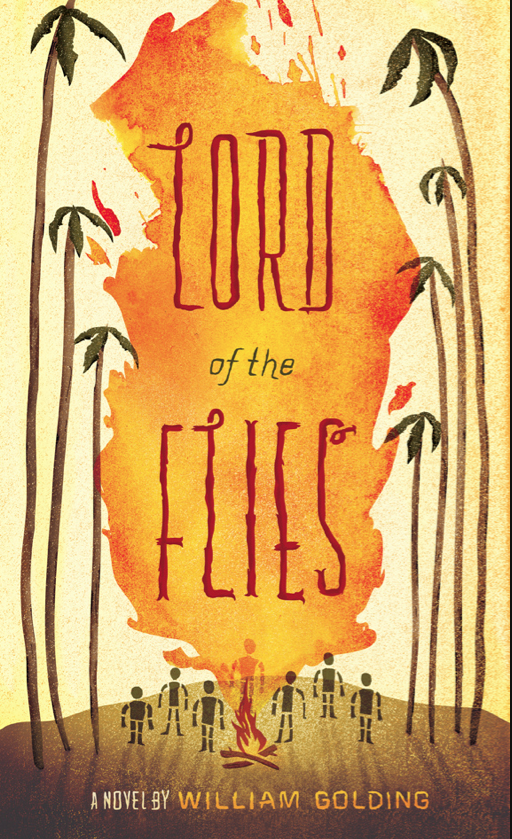

# Welcome to my book corner

Hello!  Welcome to _BookCorner_ which is my literary blog to talk about and review the books I have read.  

I have recently rekindled my love for reading during quarantine, and I have read 50 books so far this year!  So come along with me on my reading journey :)

## OCTOBER 2020

### Currently Reading

- _Lord of the Flies_
- _The Picture of Dorian Gray_
- _The Crucible_
- _A Study in Charlotte_

**Lord of the Flies**

[Link](url) and 
```


The basic premise of this story is how a group of boys who have landed on a deserted island from a plane crash learn to survive together.  This novel is an allegorical story that we are reading in English where seemingly everything in the story is a symbol of some sort.  (I will post a spoiler filled review later.)




### More Info

Want to keep track of your reading?  I would suggest using Goodreads, and you can find me on goodreads [here.](https://www.goodreads.com/user/show/104617296-kayla)  

If you would like to get yourself a copy of these books, then go to [_Lord of the Flies_](https://www.amazon.com/Lord-Flies-William-Golding/dp/0399501487/ref=sr_1_1?dchild=1&keywords=lord+of+the+flies&qid=1602116199&sr=8-1) or [_The Picture of Dorian Gray_](https://www.amazon.com/Picture-Dorian-Gray-Oscar-Wilde/dp/1515190994/ref=sr_1_4?crid=CUUS99Q6C3IC&dchild=1&keywords=the+picture+of+dorian+gray&qid=1602116259&sprefix=the+picture+of+dorian+g%2Caps%2C264&sr=8-4) !

Just keep reading :)
